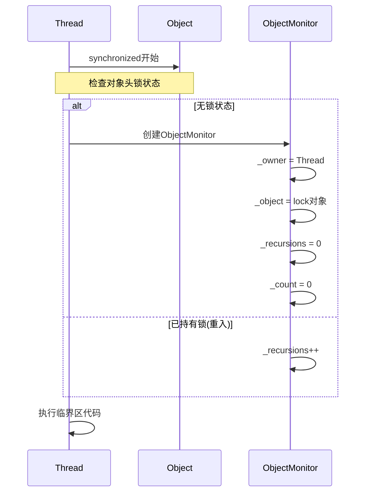
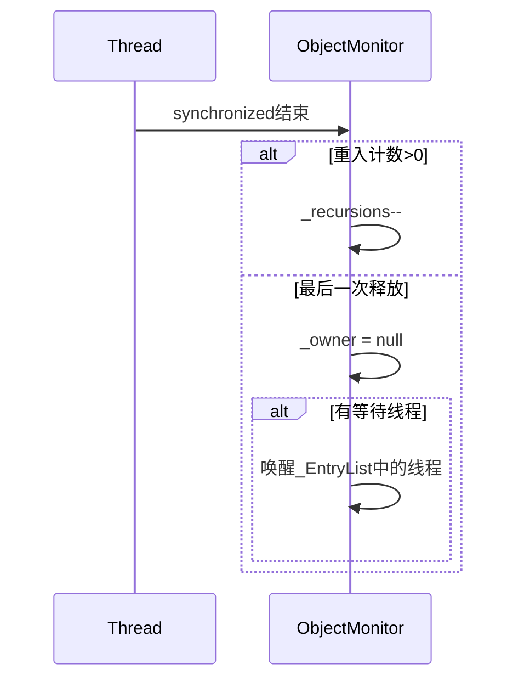
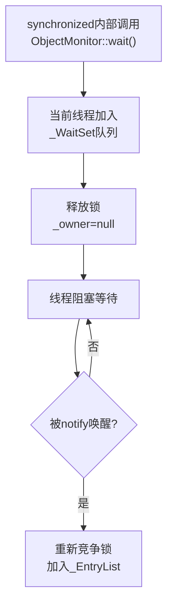
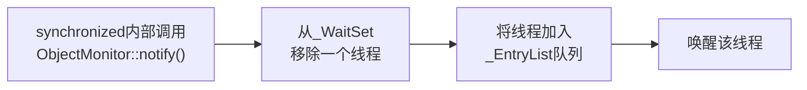
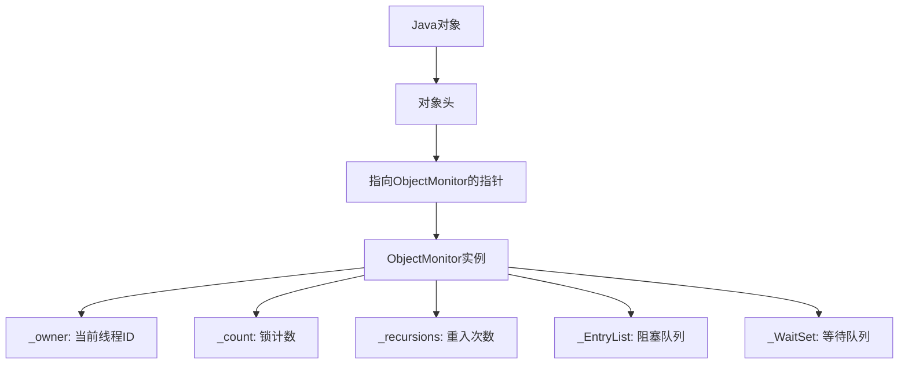
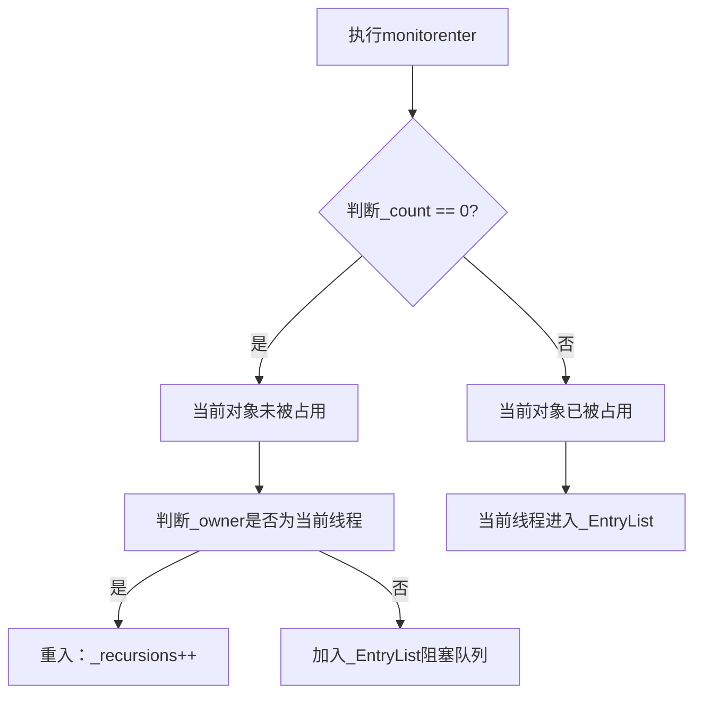
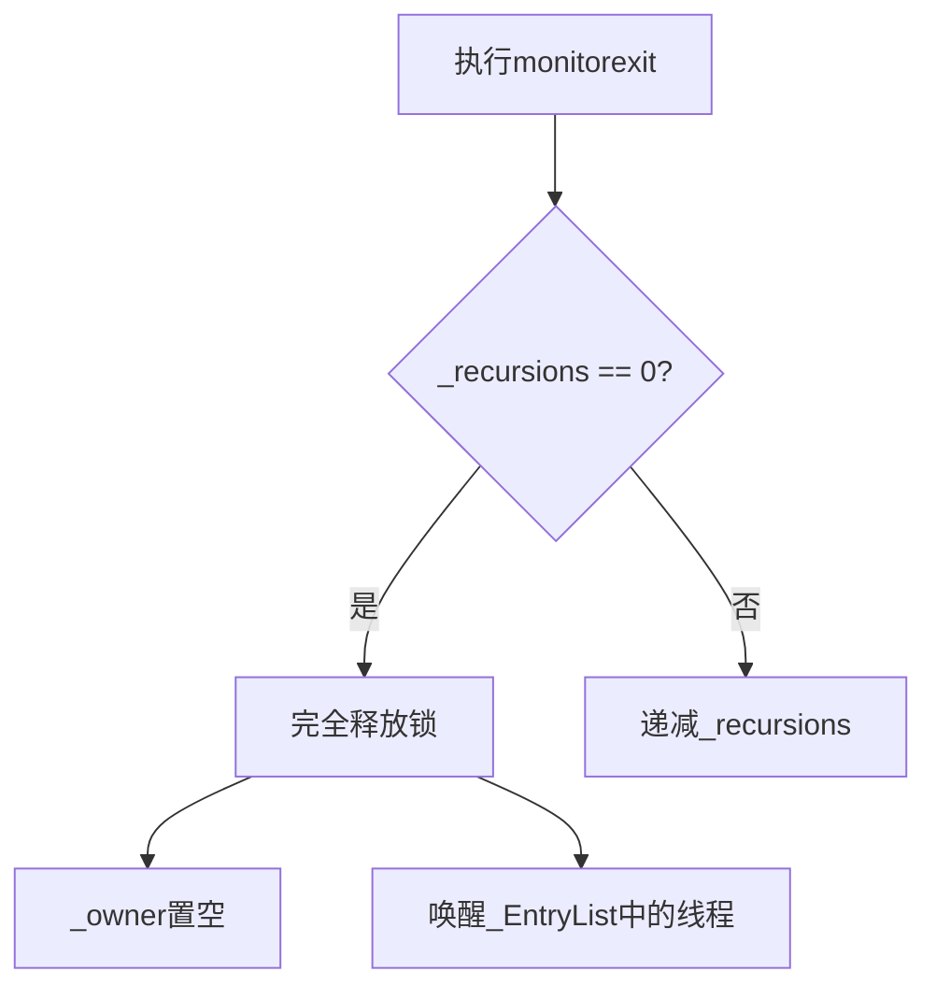

# ObjectMonitor在Synchronized锁中的作用

## 1. ObjectMonitor核心组成要素

### 1.1 关键字段及其作用

| 字段 | 类型 | 作用 |
|------|------|------|
| `_owner` | `Thread*` | 当前持有锁的线程，为`null`时表示无锁状态 |
| `_object` | `oop` | 与该监视器关联的Java对象引用 |
| `_WaitSet` | `ParkEvent*` | 调用`wait()`方法后进入等待状态的线程队列 |
| `_EntryList` | `ParkEvent*` | 等待获取锁的线程队列 |
| `_recursions` | `int` | 重入计数器，记录同一线程重复获取锁的次数 |
| `_count` | `int` | 等待获取锁的线程数量统计 |

## 2. synchronized加锁解锁过程中各字段的变化

### 2.1 加锁过程字段变化

```java
public class SyncExample {
    private final Object lock = new Object();

    public void method() {
        synchronized(lock) {  // <-- 加锁开始
            // 业务逻辑
        }                     // <-- 解锁结束
    }
}
```


**加锁时序图：**




### 2.2 解锁过程字段变化

**解锁时序图：**




## 3. wait/notify机制中字段变化

### 3.1 wait()调用过程

```java
public class WaitNotifyExample {
    private final Object lock = new Object();

    public void waitingMethod() {
        synchronized(lock) {
            try {
                lock.wait();  // <-- 调用wait()
                // 继续执行...
            } catch (InterruptedException e) {
                Thread.currentThread().interrupt();
            }
        }
    }

    public void notifyingMethod() {
        synchronized(lock) {
            lock.notify();  // <-- 调用notify()
        }
    }
}
```


**wait()执行流程及字段变化：**




### 3.2 notify()调用过程

**notify()执行流程：**




## 4. ObjectMonitor工作流程详解

### 4.1 加锁流程




### 4.2 加锁判断逻辑




### 4.3 解锁流程




## 5. 各字段具体作用与变化

### 5.1 _owner字段
- **作用**: 记录当前持有锁的线程ID
- **变化**:
    - 加锁成功后：指向当前线程
    - 完全释放锁后：置为空

### 5.2 _count字段
- **作用**: 表示当前对象是否被锁定
- **变化**:
    - 初始值：0（未锁定）
    - 加锁成功：+1（已锁定）
    - 解锁成功：-1（可能仍处于锁定状态，取决于重入情况）

### 5.3 _recursions字段
- **作用**: 记录同一线程重复获取锁的次数
- **变化**:
    - 每次进入synchronized块：+1
    - 每次退出synchronized块：-1
    - 当前线程完全退出所有嵌套的synchronized块时变为0

### 5.4 _EntryList字段
- **作用**: 存放等待获取锁的线程队列
- **变化**:
    - 当锁被占用且不是当前线程持有时，当前线程加入此队列
    - 当锁被释放时，队列中的线程有机会竞争获取锁

### 5.5 _WaitSet字段
- **作用**: 存放调用wait()方法后等待的线程队列
- **变化**:
    - 当线程调用wait()时，从拥有锁的线程变为等待状态并加入此队列
    - 当其他线程调用notify()或notifyAll()时，队列中的线程会被唤醒

## 6. 多层synchronized嵌套场景

### 6.1 重入机制示例
```java
public class ReentrantExample {
    public synchronized void methodA() {  // _recursions = 1
        methodB();                        // _recursions = 2
    }

    public synchronized void methodB() {  // _recursions = 2
        // 同一线程再次获取锁，_recursions递增
    }
    // 退出时_recursions递减，直到为0才真正释放锁
}
```


### 6.2 状态变化过程
1. 进入methodA：`_recursions = 1`
2. 进入methodB：`_recursions = 2`
3. 退出methodB：`_recursions = 1`
4. 退出methodA：`_recursions = 0`，此时`_owner`置空

## 7. 总结

`ObjectMonitor` 是 `synchronized` 关键字的底层实现核心：

1. **统一管理**: 通过 `_owner`、`_recursions` 等字段统一管理锁状态
2. **线程调度**: 利用 `_EntryList` 和 `_WaitSet` 实现线程的有序调度
3. **可重入支持**: `_recursions` 字段支持同一线程多次获取同一把锁
4. **等待通知**: 完整实现了Java对象的 `wait`/`notify` 机制